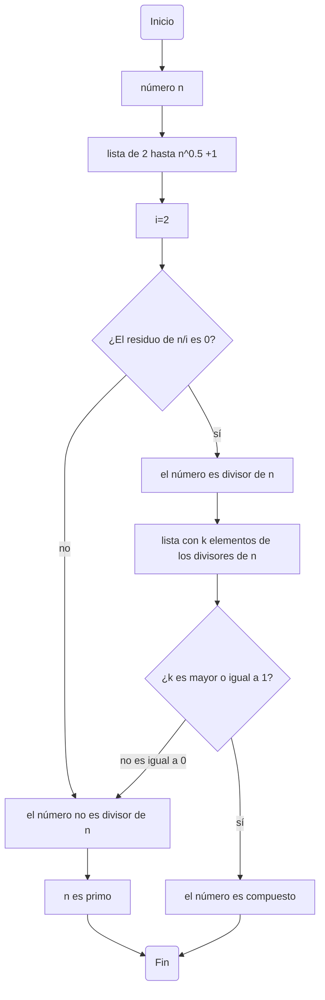

# Segundo Día Pa Roma
Vamos a desarrollar el Reto. 03 donde vamos a encontrar una forma de saber si un número natural n es primo o compuesto, con una idea representada en un pseudocódigo, y una representación visual del proceso mediante un diagrama de flujo.

## Criba de Eratóstenes (Pseudocódigo)
Una ayuda que podemos emplear para facilitar el proceso es _la criba de Eratóstenes_, la cual nos permite hallar todos los divisores de un número n.

Proceso:
```pseudocode
[Variables]
i: entero
n: entero
k: entero
inicio
i:= 2
  lista de los naturales [2,(n**0.5)+1]
  Repetir para cada i de "lista de los naturales"
    Si el residuo es != 0 entonces
      escribir("i no es divisor de n")
    Si el residuo es == 0 entonces
      escribir("i es divisor de n")
  Crear lista de los "i divisores de n" con k elementos
   Si k > 0 entonces
     escribir("n es primo")
   Si k >= 1
     escribir("n es compuesto")
fin     
```
## Diagrama de flujo
Una demostración visual del proceso que se lleva a cabo.

***
## Bibliografía
- [Clase 4](https://github.com/JBotero99/SegundoDiaPaRoma/blob/main/README.md)
- [Clase 5](https://github.com/fegonzalez7/pdc_unal_clase5/blob/master/README.md)
